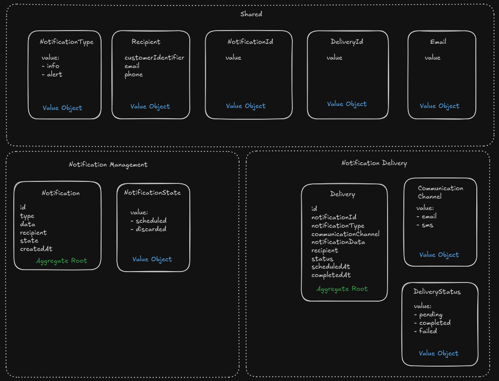
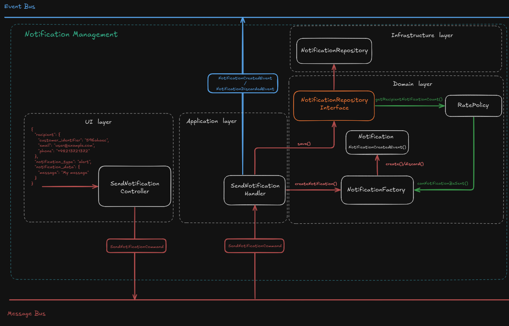
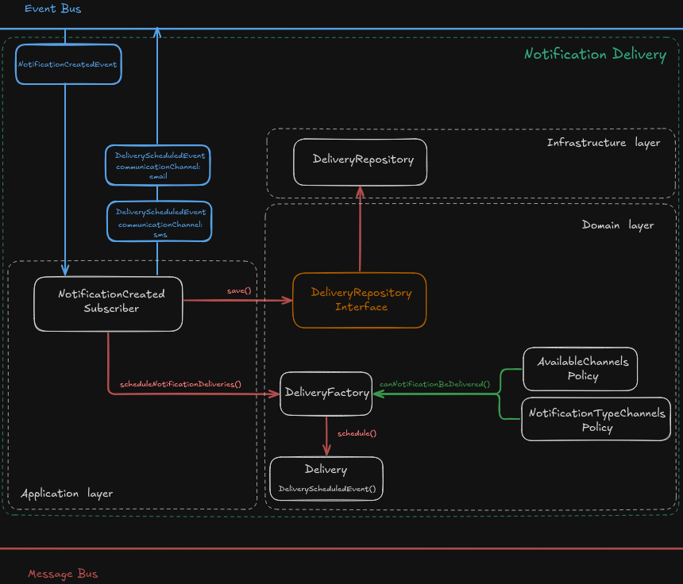
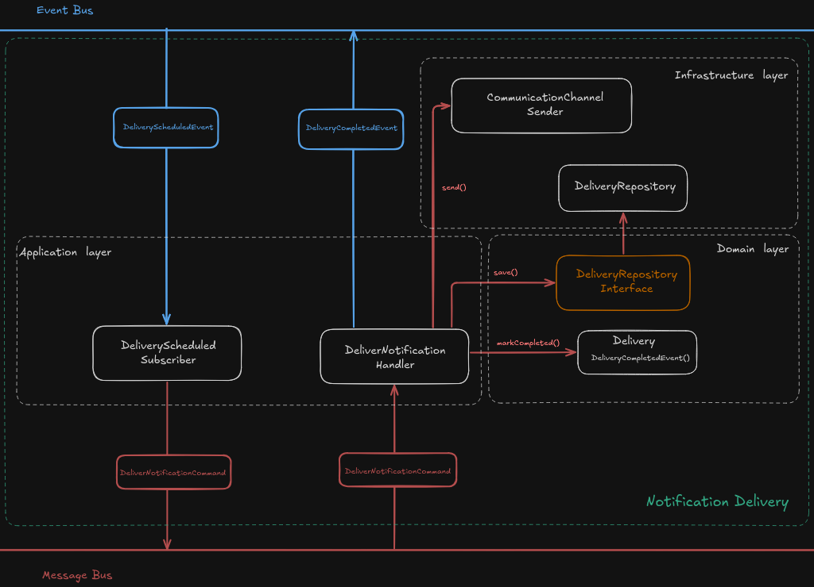
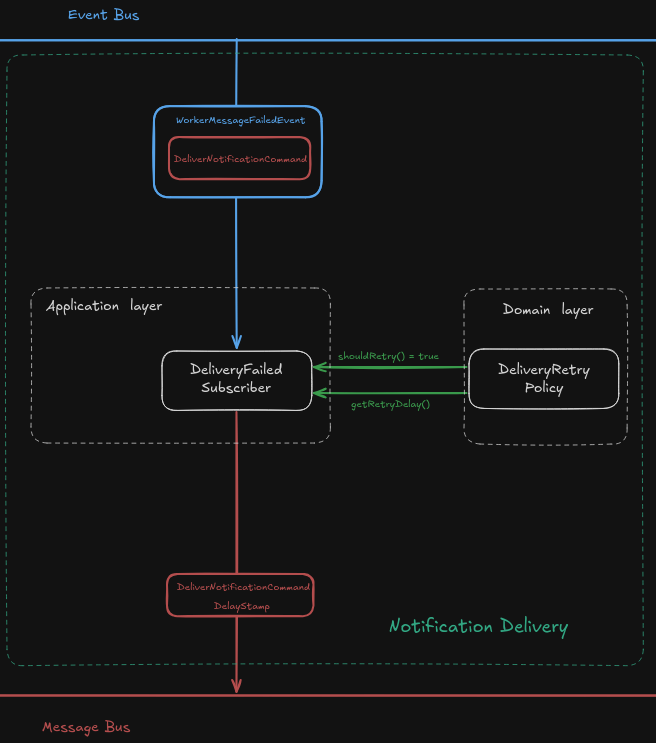
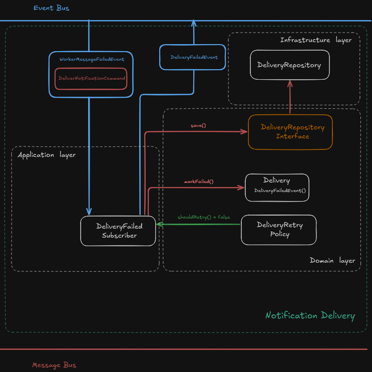

## Notification Publisher Microservice
A Dockerized microservice built with Symfony and RabbitMQ, following the Domain-Driven Design (DDD) pattern. This service allows sending notifications through multiple channels with support for failover and configurable options.

Features:
- Sending notifications via Email and SMS.
- Multiple providers per channel (failover capability).
- Sending the same notification across multiple channels.
- Enable or disable channels via configuration.
- Configurable rate limiting for alert notifications.
- Usage tracking for monitoring sent notifications.

## How to run locally

Requirements:
- [Docker](https://docs.docker.com/engine/install/) installed on your system
- Mailing service provider(supported: ***SMTP***, ***Amazon SES***)
- Sms service provider(supported: ***Twilio***, ***Infobip***)

1. Create `.env.local` file using `.env.local.example` as template and fill it with your own credentials/configs.
2. Run `docker compose up -d` to run docker containers.
3. Open `http://localhost:8000/api/doc` to display OpenApi documentation.

## Project explanation

<h3 style="text-align:center;">Context Map</h3>

<h3 style="text-align: center;">Send Notification Action Flow</h3>

### 1. Creating/discarding notification based on notification management policy.

### 2. Scheduling deliveries based on notification delivery policies.

### 3. Handling scheduled deliveries.

### 4. Retrying failed deliveries.

### 5. Handling failed deliveries when no retries available.

